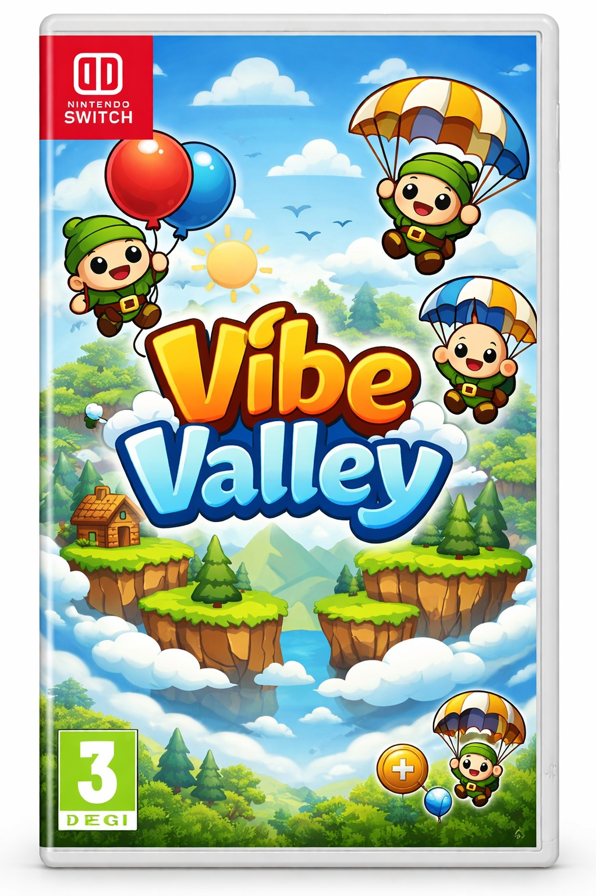

# vivimoli

Client-side browser game scaffold met React UI, Pixi renderer en bitecs ECS engine in TypeScript.

## Stack

- React + Vite (SPA)
- PixiJS (renderlaag)
- bitecs (ECS)
- Zustand + XState + Immer (UI/control state)
- ESLint + Biome + Vitest

## Kernarchitectuur

- `src/engine/**` is pure simulatie (geen browser APIs, geen render/UI imports).
- `src/ui/**` praat met engine alleen via `src/engine/public.ts`.
- `src/render/**` leest engine read-model en doet alleen visual sync.
- `src/adapters/**` bevat browser-afhankelijke implementaties (time/storage/network).

## Scripts

- `npm run dev` start Vite dev server
- `npm run build` typecheck + production build
- `npm run preview` preview van production build
- `npm run typecheck` TypeScript checks
- `npm run lint` ESLint checks inclusief boundaries/cycles
- `npm run format` Biome write
- `npm run format:check` Biome check
- `npm run test` Vitest run

## Change discipline

- Werk `specs/` bij bij elke contract- of gedragswijziging.
- Werk `adr/` bij bij architectuurkeuzes/afwijkingen.
- Voeg Vitest tests toe voor engine-gedrag, of motiveer kort waarom niet nodig.
